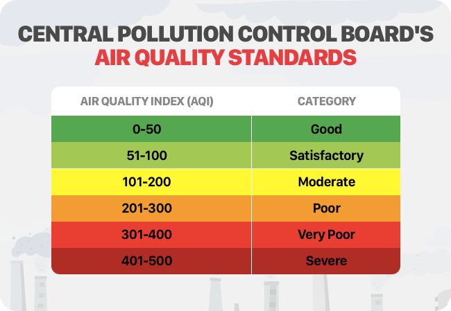

# AIR QUALITY INDEX PREDICTOR

## What is Air Quality Index?

The air quality index (AQI) is an index for reporting air quality on a daily basis. It is a measure of how air pollution affects one's health within a short time period. The purpose of the AQI is to help people know how the local air quality impacts their health.

## How is Air Quality Index measured?

Air quality is measured with the Air Quality Index, or AQI. The AQI works sort of like a thermometer that runs from 0 to 500 degrees. However, instead of showing changes in the temperature, the AQI is a way of showing changes in the amount of pollution in the air.
The **air quality meter PCE-RCM 05** is used to continuously measure the particulate matter content at the workplace. The air quality meter displays **PM2. 5** particulate matter as well as temperature and humidity on the display.

## How Air Quality index is measured in my project :-

Instead of using an expensive instrument to measure the AQI. This project aims to measure the AQI using easily available **climate conditions** values to predict **PM 2.5** value. 
The parameters used to predict AQI in this project are -
- Average Temperature (°C)
- Maximum temperature (°C)
- Minimum temperature (°C)
- Atmospheric pressure at sea level (hPa)
- Average relative humidity (%)
- Average visibility (Km)
- Average wind speed (Km/h)
- Maximum sustained wind speed (Km/h)
 
 All of these parameters are easily available on common weather and climate websites (for eg. - https://en.tutiempo.net/ )
 
 Enter the values of these parameters in the **project website ( https://airquality-index-predictor.herokuapp.com/ )** and click on pedict to get Air Quality index.
 
 **ADVANTAGE OF THIS PROJECT IS THAT WE CAN PREDICT THE AIR QUALITY INDEX USING COMMON CLIMATE ATTRIBUTES INSTEAD OF USING AN EXPENSIVE PHYSICAL INSTRUMENT.**
 
## Life cycle of this data science project -

Life cycle of this project can be divided into 3 parts :- 
- Data Collection and Data Cleaning
- Feature Engineering and Model Building
- Deployment of project on web

### Data collection and Data cleaning - 

- For collection of **Independent features** , downloaded the HTML pages from https://en.tutiempo.net/ for web scrapping. **(HTML_script.py)**
- For collection of **Dependent featutes**, downloaded csv files of AQI from a 3rd party source(www.weathermap.com) and processed the files to convert them into usuable form. **(PLOT_AQI.py)**
- Performed **web scrapping** on HTML pages to extract Independent features using **BeautifulSoup** library. Then prepared the final dataset by combining Independent and Dependent features. Then cleaned the data to get rid of null and invalid values. **(Extract_combine.py)**

### Feature Enginnering and Model Building - 

- Performed Feature engineering and data visualization on final dataset. **(LinearRegression.ipynb)**
- Build a Linear Regression Model,trained the model using dataset and used evaluation metrics to check efficiency of model **(LinearRegression.ipynb)**
- Build a Lasso Regression Model,trained the model using dataset and used evaluation metrics to check efficiency of model **(lasso_regression.ipynb)**
- Build a Decision Tree Regression Model,trained the model using dataset and used evaluation metrics to check efficiency of model **(DecisionTreeRegressor.ipynb)**
- Build a Random Forest Regression Model,trained the model using dataset and used evaluation metrics to check efficiency of model **(RandomForestRegressor.ipynb)**
- Build a Xgboost Regression Model,trained the model using dataset and used evaluation metrics to check efficiency of model **(XgboostRegressor.ipynb)**

Maximum accurary was achieved by RandomForestRegressor. Created a pickle file for randomforestregressor model.

### Project Deployment -

refer to the below link -

https://github.com/chittoriabhi/aqideployment

